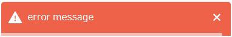

# Super-Simple-React-Toast

[demo site](https://jhk48.github.io/super-simple-react-toast/)

## Prerequisites

- [react](https://www.npmjs.com/package/react) v16.8.0 or higher
- [react-dom](https://www.npmjs.com/package/react-dom) v16.8.0 or higer

**browser compatibility**

- `IE`: not supported 
- `Chrome`: v51 or higher
- `Safari`: v10 or higher
- `Firefox`: v54 or higher
- `Edge`: v15 or higher
- `Opera`: v38 or higher
- `Samsung Internet`: v5 or higher

## Installation

**With NPM**

```bash
npm install super-simple-react-toast
```

**With yarn**

```bash
yarn add super-simple-react-toast
```

## Getting Started

First, add a container HTML element in your html file where react root element exists (I used toast container element's id as `toast-root`, but whatever name is OK):

```html
<body>
  ...
  <div id="root"></div>
  ...
  <div id="toast-root"></div>
</body>
```

Next, instantiate a toast instance by giving the toast root element we've just created, and pass this as a prop to `ToastProvider`:

```tsx
import { ToastProvider, Toast } from 'super-simple-react-toast';

const toastInstance = new Toast(document.getElementById('toast-root'));

export default function App() {
  return (
    <ToastProvider toastInstance={toastInstance}>
      <Example />
    </ToastProvider>
  );
}
```

Lastly, `useToast` inside of a component and invoke a method of a message type you want to notify:

```tsx
import { useToast } from 'super-simple-react-toast';

function Example() {
  const toast = useToast();

  const notifySuccessMessage = () =>
    toast.success({
      message: 'Hello, world!'
  });

  return (
    <div>
      <button onClick={notifySuccessMessage}>Success Message</button>
    </div>
  );
}
```

## APIs

### Message Types

In this library, there are 4 message types:

**success**

```ts
toast.success({ message: 'A success message' });
```


**warning**

```ts
toast.warning({ message: 'A warning message' });
```


**info**

```ts
toast.info({ message: 'A info message' });
```


**error**

```ts
toast.error({ message: 'A error message' });
```




### Message duration

By default, the message is shown in 3000ms. You can adjust this by providing `duration` property when invoking a method:

```ts
// Default duration is 3000ms
toast.success({ message: 'hello, world' });

// Set duration to 5000ms
// (i.e., the message disappears automatically after 5000ms).
toast.success({
  message: 'hello, world',
  duration: 5000
});

// Maximum duration is 2,147,483,647ms
// because the library is using setTimeout internally.
toast.success({
  message: 'hello, world',
  duration: 2147483647 // maximum duration
});

// So if the given duration is greater than 2^31 - 1,
// it won't work correctly.
toast.success({
  message: 'hello, world',
  duration: 2147483648 // Oops!
});
```

### Position

There are total of 6 positions message can appear:

- `topLeft`
- `topCenter`
- `topRight`
- `bottomLeft`
- `bottomCenter`
- `bottomRight`

You can set position of a message by providing `position` property. The default position is `topLeft`.

```ts
// Default position is topLeft.
toast.success({
  message: 'hello, world'
});

// Set position to topRight.
toast.success({
  message: 'hello, world',
  position: 'topRight'
});
```

### Maximum number of messages per position

You can set the maximum number of messages per position by providing `maxNumOfMessages` property.

The default is `0`, which means there's no limit on number of messages per position.

```ts
// Default is 0 (i.e. you can show an infinite number of messages).
toast.success({
  message: 'hello, world'
});

// Set max num of messages to 5 in the topLeft position.
toast.success({
  message: 'hello, world',
  maxNumOfMessages: 5
});

// Set max num of messages to 3 in the bottomCenter position.
toast.success({
  message: 'hello, world',
  position: 'bottomCenter',
  maxNumOfMessages: 3
});

// Of course you can set max num of messages in different position simultaneously.
// Here, we set max num to 3 in topCenter and 5 in bottomLeft
// so up to 3 messages will appear on topCenter position
// while up to 5 messages will appear on bottomLeft position.
toast.success({
  message: 'hello, world',
  position: 'topCenter',
  maxNumOfMessages: 3
});

toast.success({
  message: 'hello, world',
  position: 'bottomLeft',
  maxNumOfMessages: 5
});
```
